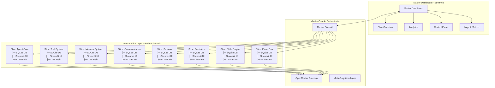
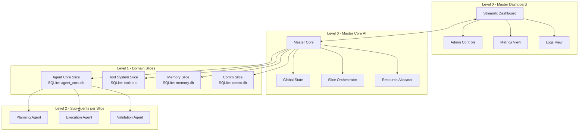
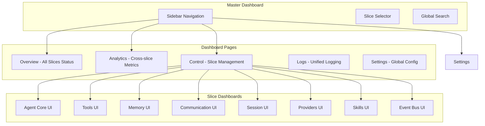
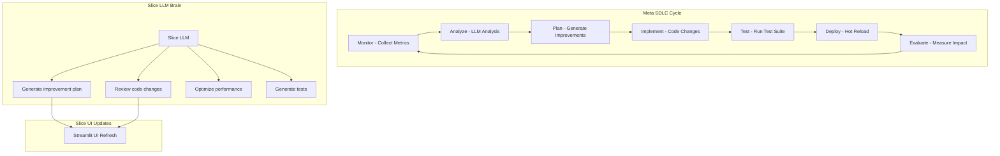

# 🔮 REFACTORBOT V2 - VERTICAL SLICE ARCHITECTURE IMPLEMENTATION

## 📋 Executive Summary

RefactorBot is a **Self-Aware Atomic Vertical Slice Architecture** where each slice is a meta-agent with its own LLM capabilities, SQLite database, and dedicated UI. A Master Dashboard built with Streamlit orchestrates and monitors all slices.

### Key Objectives
- **Atomic Responsibility**: Each slice owns a single domain concern completely
- **Full-Stack Slices**: Each slice has its own SQLite database and UI
- **Self-Awareness**: Each slice has its own LLM for meta-reasoning and self-improvement
- **Hierarchical Orchestration**: Master Core AI controls and coordinates all slices
- **Meta SDLC**: Each slice can self-improve, test, and deploy itself
- **Master Dashboard**: Streamlit-based unified UI for all slices
- **Production Ready**: Full test suite, observability, and deployment automation
- **OpenRouter Integration**: Unified multi-model access layer

---

## 🏗️ Architecture Overview

### High-Level System Architecture



### Hierarchical Agent Orchestration



---

## 🎯 Vertical Slice Definition

### Slice Contract Interface

Every vertical slice MUST implement:

```python
class AtomicSlice(Protocol):
    """Base protocol for all atomic slices"""
    
    @property
    def slice_id(self) -> str: ...
    @property
    def slice_name(self) -> str: ...
    @property
    def slice_version(self) -> str: ...
    @property
    def llm_provider(self) -> LLMProvider: ...
    @property
    def database(self) -> SliceDatabase: ...
    
    async def initialize(self, context: SliceContext) -> None: ...
    async def execute(self, request: SliceRequest) -> SliceResponse: ...
    async def self_improve(self, feedback: ImprovementFeedback) -> ImprovementPlan: ...
    async def health_check(self) -> HealthStatus: ...
    async def get_capabilities(self) -> SliceCapabilities: ...
    
    # UI Methods
    def get_dashboard(self) -> StreamlitPage: ...
    def render_ui(self) -> None: ...
```

### Full-Stack Slice Structure Template

```
slice_name/
├── __init__.py
├── slice.yaml                    # Slice configuration
├── slice_meta.py                 # Slice metadata & self-awareness
├── pyproject.toml                # Python project file
├── requirements.txt              # Dependencies
│
├── core/                         # Core business logic
│   ├── __init__.py
│   ├── models.py                 # Domain models (Pydantic)
│   ├── services.py               # Business services
│   └── validators.py             # Input/output validators
│
├── database/                     # SQLite database layer
│   ├── __init__.py
│   ├── db_manager.py             # Database connection manager
│   ├── migrations/               # Database migrations
│   │   ├── __init__.py
│   │   └──001_initial.sql
│   ├── repositories/             # Data access layer
│   │   ├── __init__.py
│   │   └── base_repository.py
│   └── schema.sql               # Database schema
│
├── llm/                          # Slice's own LLM brain
│   ├── __init__.py
│   ├── provider.py               # LLM provider config
│   ├── prompts.py                # Self-improvement prompts
│   └── meta_reasoning.py         # Meta-cognition engine
│
├── ui/                           # Streamlit UI
│   ├── __init__.py
│   ├── pages/
│   │   ├── __init__.py
│   │   ├── dashboard.py          # Main dashboard page
│   │   ├── analytics.py          # Analytics page
│   │   └── config.py             # Configuration page
│   ├── components/
│   │   ├── __init__.py
│   │   ├── charts.py             # Visualization components
│   │   ├── forms.py              # Form components
│   │   └── tables.py             # Data table components
│   └── theme/
│       ├── __init__.py
│       └── config.toml           # Streamlit theme config
│
├── plugins/                      # Plugin extensions
│   ├── __init__.py
│   └── extensions.py
│
├── tests/                        # Slice test suite
│   ├── __init__.py
│   ├── conftest.py              # Test fixtures
│   ├── unit/
│   ├── integration/
│   └── e2e/
│
├── docs/                         # Slice documentation
│   ├── README.md
│   └── API.md
│
├── ci_cd/                        # Meta SDLC for slice
│   ├── Dockerfile
│   ├── docker-compose.yml
│   ├── test.sh
│   ├── deploy.sh
│   └── self_improve.sh
│
└── api/                          # REST API
    ├── __init__.py
    ├── routes.py                 # API endpoints
    └── middleware.py             # Auth, rate limiting
```

---

## 🔷 Full-Stack Slice Specifications

### Slice 1: Agent Core Slice (`slice_agent_core`)

**Location**: `refactorbot/slices/slice_agent_core/`

**Database**: `data/slice_agent_core.db`

```python
# database/schema.sql
CREATE TABLE IF NOT EXISTS agent_sessions (
    id TEXT PRIMARY KEY,
    user_id TEXT,
    context TEXT,
    state TEXT,
    created_at TIMESTAMP DEFAULT CURRENT_TIMESTAMP,
    updated_at TIMESTAMP DEFAULT CURRENT_TIMESTAMP
);

CREATE TABLE IF NOT EXISTS agent_executions (
    id TEXT PRIMARY KEY,
    session_id TEXT,
    request TEXT,
    response TEXT,
    tokens_used INTEGER,
    duration_ms INTEGER,
    success BOOLEAN,
    FOREIGN KEY (session_id) REFERENCES agent_sessions(id)
);

CREATE TABLE IF NOT EXISTS prompt_templates (
    id TEXT PRIMARY KEY,
    name TEXT,
    template TEXT,
    description TEXT,
    version INTEGER DEFAULT 1
);

CREATE INDEX idx_executions_session ON agent_executions(session_id);
```

**UI Pages**:
- `pages/dashboard.py` - Session management, execution history
- `pages/analytics.py` - Token usage, performance metrics
- `pages/config.py` - Prompt template editor, LLM settings

### Slice 2: Tool System Slice (`slice_tools`)

**Location**: `refactorbot/slices/slice_tools/`

**Database**: `data/slice_tools.db`

```python
# database/schema.sql
CREATE TABLE IF NOT EXISTS tools (
    id TEXT PRIMARY KEY,
    name TEXT UNIQUE,
    description TEXT,
    schema TEXT,
    category TEXT,
    enabled BOOLEAN DEFAULT 1,
    version TEXT,
    created_at TIMESTAMP DEFAULT CURRENT_TIMESTAMP
);

CREATE TABLE IF NOT EXISTS tool_executions (
    id TEXT PRIMARY KEY,
    tool_id TEXT,
    parameters TEXT,
    result TEXT,
    success BOOLEAN,
    error_message TEXT,
    duration_ms INTEGER,
    executed_at TIMESTAMP DEFAULT CURRENT_TIMESTAMP,
    FOREIGN KEY (tool_id) REFERENCES tools(id)
);

CREATE TABLE IF NOT EXISTS tool_categories (
    id TEXT PRIMARY KEY,
    name TEXT UNIQUE,
    description TEXT
);
```

**UI Pages**:
- `pages/dashboard.py` - Tool registry, execution log
- `pages/analytics.py` - Tool usage stats, error rates
- `pages/config.py` - Add/Edit tools, schema editor

### Slice 3: Memory System Slice (`slice_memory`)

**Location**: `refactorbot/slices/slice_memory/`

**Database**: `data/slice_memory.db`

```python
# database/schema.sql
CREATE TABLE IF NOT EXISTS memories (
    id TEXT PRIMARY KEY,
    content TEXT,
    memory_type TEXT,
    embedding TEXT,
    relevance_score REAL,
    user_id TEXT,
    session_id TEXT,
    created_at TIMESTAMP DEFAULT CURRENT_TIMESTAMP,
    last_accessed_at TIMESTAMP DEFAULT CURRENT_TIMESTAMP,
    access_count INTEGER DEFAULT 0
);

CREATE TABLE IF NOT EXISTS memory_consolidation (
    id TEXT PRIMARY KEY,
    source_ids TEXT,
    consolidated_content TEXT,
    created_at TIMESTAMP DEFAULT CURRENT_TIMESTAMP
);

CREATE TABLE IF NOT EXISTS memory_tags (
    id TEXT PRIMARY KEY,
    memory_id TEXT,
    tag TEXT,
    FOREIGN KEY (memory_id) REFERENCES memories(id)
);

CREATE INDEX idx_memories_user ON memories(user_id);
CREATE INDEX idx_memories_type ON memories(memory_type);
```

**UI Pages**:
- `pages/dashboard.py` - Memory browser, search
- `pages/analytics.py` - Memory stats, consolidation logs
- `pages/config.py` - Retention settings, consolidation rules

### Slice 4: Communication Slice (`slice_communication`)

**Location**: `refactorbot/slices/slice_communication/`

**Database**: `data/slice_communication.db`

```python
# database/schema.sql
CREATE TABLE IF NOT EXISTS channels (
    id TEXT PRIMARY KEY,
    name TEXT UNIQUE,
    type TEXT,
    config TEXT,
    enabled BOOLEAN DEFAULT 1,
    created_at TIMESTAMP DEFAULT CURRENT_TIMESTAMP
);

CREATE TABLE IF NOT EXISTS messages (
    id TEXT PRIMARY KEY,
    channel_id TEXT,
    sender_id TEXT,
    content TEXT,
    message_type TEXT,
    metadata TEXT,
    timestamp TIMESTAMP DEFAULT CURRENT_TIMESTAMP,
    FOREIGN KEY (channel_id) REFERENCES channels(id)
);

CREATE TABLE IF NOT EXISTS message_templates (
    id TEXT PRIMARY KEY,
    name TEXT,
    template TEXT,
    channel_type TEXT
);

CREATE INDEX idx_messages_channel ON messages(channel_id);
CREATE INDEX idx_messages_sender ON messages(sender_id);
```

**UI Pages**:
- `pages/dashboard.py` - Channel overview, message log
- `pages/analytics.py` - Message volume, response times
- `pages/config.py` - Channel setup, template management

### Slice 5: Session Management Slice (`slice_session`)

**Location**: `refactorbot/slices/slice_session/`

**Database**: `data/slice_session.db`

```python
# database/schema.sql
CREATE TABLE IF NOT EXISTS sessions (
    id TEXT PRIMARY KEY,
    user_id TEXT,
    session_type TEXT,
    state TEXT,
    metadata TEXT,
    started_at TIMESTAMP DEFAULT CURRENT_TIMESTAMP,
    ended_at TIMESTAMP,
    last_activity TIMESTAMP DEFAULT CURRENT_TIMESTAMP
);

CREATE TABLE IF NOT EXISTS conversation_history (
    id TEXT PRIMARY KEY,
    session_id TEXT,
    role TEXT,
    content TEXT,
    tokens INTEGER,
    timestamp TIMESTAMP DEFAULT CURRENT_TIMESTAMP,
    FOREIGN KEY (session_id) REFERENCES sessions(id)
);

CREATE TABLE IF NOT EXISTS session_analytics (
    id TEXT PRIMARY KEY,
    session_id TEXT,
    total_messages INTEGER,
    total_tokens INTEGER,
    avg_response_time_ms REAL,
    FOREIGN KEY (session_id) REFERENCES sessions(id)
);

CREATE INDEX idx_sessions_user ON sessions(user_id);
CREATE INDEX idx_history_session ON conversation_history(session_id);
```

**UI Pages**:
- `pages/dashboard.py` - Active sessions, session list
- `pages/analytics.py` - Session metrics, user stats
- `pages/config.py` - Session settings, archival rules

### Slice 6: Providers Slice (`slice_providers`)

**Location**: `refactorbot/slices/slice_providers/`

**Database**: `data/slice_providers.db`

```python
# database/schema.sql
CREATE TABLE IF NOT EXISTS providers (
    id TEXT PRIMARY KEY,
    name TEXT UNIQUE,
    provider_type TEXT,
    api_endpoint TEXT,
    api_key TEXT,
    models TEXT,
    enabled BOOLEAN DEFAULT 1,
    created_at TIMESTAMP DEFAULT CURRENT_TIMESTAMP
);

CREATE TABLE IF NOT EXISTS model_configurations (
    id TEXT PRIMARY KEY,
    provider_id TEXT,
    model_name TEXT,
    capabilities TEXT,
    cost_per_1k_tokens REAL,
    max_tokens INTEGER,
    enabled BOOLEAN DEFAULT 1,
    FOREIGN KEY (provider_id) REFERENCES providers(id)
);

CREATE TABLE IF NOT EXISTS cost_tracking (
    id TEXT PRIMARY KEY,
    provider_id TEXT,
    model_name TEXT,
    request_id TEXT,
    prompt_tokens INTEGER,
    completion_tokens INTEGER,
    total_cost REAL,
    timestamp TIMESTAMP DEFAULT CURRENT_TIMESTAMP,
    FOREIGN KEY (provider_id) REFERENCES providers(id)
);

CREATE INDEX idx_cost_tracking_date ON cost_tracking(timestamp);
```

**UI Pages**:
- `pages/dashboard.py` - Provider status, model selection
- `pages/analytics.py` - Cost tracking, usage analytics
- `pages/config.py` - Provider setup, model configuration

### Slice 7: Skills Engine Slice (`slice_skills`)

**Location**: `refactorbot/slices/slice_skills/`

**Database**: `data/slice_skills.db`

```python
# database/schema.sql
CREATE TABLE IF NOT EXISTS skills (
    id TEXT PRIMARY KEY,
    name TEXT UNIQUE,
    description TEXT,
    skill_file TEXT,
    metadata TEXT,
    enabled BOOLEAN DEFAULT 1,
    version TEXT,
    created_at TIMESTAMP DEFAULT CURRENT_TIMESTAMP,
    updated_at TIMESTAMP DEFAULT CURRENT_TIMESTAMP
);

CREATE TABLE IF NOT EXISTS skill_executions (
    id TEXT PRIMARY KEY,
    skill_id TEXT,
    parameters TEXT,
    result TEXT,
    success BOOLEAN,
    error_message TEXT,
    duration_ms INTEGER,
    executed_at TIMESTAMP DEFAULT CURRENT_TIMESTAMP,
    FOREIGN KEY (skill_id) REFERENCES skills(id)
);

CREATE TABLE IF NOT EXISTS skill_dependencies (
    id TEXT PRIMARY KEY,
    skill_id TEXT,
    dependency TEXT,
    version_constraint TEXT,
    FOREIGN KEY (skill_id) REFERENCES skills(id)
);

CREATE INDEX idx_skills_enabled ON skills(enabled);
CREATE INDEX idx_executions_skill ON skill_executions(skill_id);
```

**UI Pages**:
- `pages/dashboard.py` - Skill registry, execution log
- `pages/analytics.py` - Skill usage, performance metrics
- `pages/config.py` - Skill upload, YAML editor (with security fixes)

### Slice 8: Event Bus Slice (`slice_event_bus`)

**Location**: `refactorbot/slices/slice_event_bus/`

**Database**: `data/slice_event_bus.db`

```python
# database/schema.sql
CREATE TABLE IF NOT EXISTS events (
    id TEXT PRIMARY KEY,
    event_type TEXT,
    source_slice TEXT,
    payload TEXT,
    status TEXT,
    created_at TIMESTAMP DEFAULT CURRENT_TIMESTAMP,
    processed_at TIMESTAMP
);

CREATE TABLE IF NOT EXISTS subscriptions (
    id TEXT PRIMARY KEY,
    event_type TEXT,
    subscriber_slice TEXT,
    callback_url TEXT,
    enabled BOOLEAN DEFAULT 1
);

CREATE TABLE IF NOT EXISTS event_queues (
    id TEXT PRIMARY KEY,
    queue_name TEXT,
    event_type TEXT,
    max_size INTEGER DEFAULT 1000,
    current_size INTEGER DEFAULT 0,
    created_at TIMESTAMP DEFAULT CURRENT_TIMESTAMP
);

CREATE TABLE IF NOT EXISTS event_metrics (
    id TEXT PRIMARY KEY,
    event_type TEXT,
    total_count INTEGER,
    success_count INTEGER,
    failure_count INTEGER,
    avg_processing_ms REAL,
    timestamp TIMESTAMP DEFAULT CURRENT_TIMESTAMP
);

CREATE INDEX idx_events_type ON events(event_type);
CREATE INDEX idx_events_status ON events(status);
CREATE INDEX idx_queues_name ON event_queues(queue_name);
```

**UI Pages**:
- `pages/dashboard.py` - Event monitor, queue status
- `pages/analytics.py` - Event throughput, latency metrics
- `pages/config.py` - Queue configuration, subscription setup

---

## 🎛️ Master Dashboard (Streamlit)

### Dashboard Architecture



### Master Dashboard Structure

```
refactorbot/master_dashboard/
├── __init__.py
├── app.py                        # Main Streamlit app entry
├── config.py                     # Dashboard configuration
├── theme/
│   └── config.toml              # Streamlit theme
│
├── pages/
│   ├── __init__.py
│   ├── 01_overview.py           # All slices overview
│   ├── 02_analytics.py         # Cross-slice analytics
│   ├── 03_control.py           # Slice control panel
│   ├── 04_logs.py              # Unified logging view
│   └── 05_settings.py          # Global settings
│
├── components/
│   ├── __init__.py
│   ├── sidebar.py              # Navigation sidebar
│   ├── metrics_grid.py        # Metrics display
│   ├── slice_status_card.py   # Individual slice status
│   ├── unified_search.py      # Global search
│   └── chart_config.py        # Chart configurations
│
├── services/
│   ├── __init__.py
│   ├── slice_connector.py     # Connect to slice APIs
│   ├── aggregation.py         # Cross-slice data aggregation
│   └── export.py              # Data export services
│
└── utils/
    ├── __init__.py
    └── formatters.py           # Data formatting utilities
```

### Master Dashboard App (`app.py`)

```python
import streamlit as st
from master_dashboard.pages import (
    overview_page,
    analytics_page,
    control_page,
    logs_page,
    settings_page
)
from master_dashboard.components.sidebar import render_sidebar

def main():
    st.set_page_config(
        page_title="RefactorBot Dashboard",
        page_icon="🤖",
        layout="wide",
        initial_sidebar_state="expanded"
    )
    
    # Render sidebar navigation
    page = render_sidebar()
    
    # Page routing
    if page == "Overview":
        overview_page.render()
    elif page == "Analytics":
        analytics_page.render()
    elif page == "Control":
        control_page.render()
    elif page == "Logs":
        logs_page.render()
    elif page == "Settings":
        settings_page.render()

if __name__ == "__main__":
    main()
```

---

## 🧠 Master Core AI Orchestrator

### Master Core Architecture

```python
class MasterCoreAI:
    """
    Master Core AI - Orchestrates all slices
    Global state management, resource allocation, meta-orchestration
    """
    
    def __init__(self, config: MasterCoreConfig):
        self.global_state = GlobalStateManager()
        self.slice_orchestrator = SliceOrchestrator()
        self.resource_allocator = ResourceAllocator()
        self.meta_scheduler = MetaScheduler()
        self.observability = ObservabilityManager()
        self.dashboard_connector = DashboardConnector()
        
    async def orchestrate(self, request: OrchestrationRequest) -> Response:
        # 1. Parse request and determine required slices
        required_slices = await self.determine_slices(request)
        
        # 2. Allocate resources
        resources = await self.resource_allocator.allocate(required_slices)
        
        # 3. Execute slice orchestration
        results = await self.slice_orchestrator.execute(
            slices=required_slices,
            resources=resources,
            context=request.context
        )
        
        # 4. Update dashboard metrics
        await self.dashboard_connector.update_metrics(results)
        
        # 5. Aggregate and return response
        return await self.aggregate_results(results)
```

### Global State Management with SQLite

```python
# Global state stored in master database
CREATE TABLE IF NOT EXISTS global_state (
    key TEXT PRIMARY KEY,
    value TEXT,
    updated_at TIMESTAMP DEFAULT CURRENT_TIMESTAMP
);

CREATE TABLE IF NOT slice_states (
    slice_id TEXT PRIMARY KEY,
    status TEXT,
    health_status TEXT,
    last_heartbeat TIMESTAMP,
    resource_usage TEXT,
    metrics TEXT
);
```

---

## 🌐 OpenRouter Integration Layer

### OpenRouter Gateway Architecture

```python
class OpenRouterGateway:
    """
    Unified LLM access layer via OpenRouter
    Supports model routing, cost tracking, fallback strategies
    """
    
    def __init__(self, config: OpenRouterConfig):
        self.client = OpenRouterClient(api_key=config.api_key)
        self.model_router = ModelRouter()
        self.cost_tracker = CostTracker()
        self.fallback_manager = FallbackManager()
        
    async def complete(self, request: LLMRequest) -> LLMResponse:
        # 1. Route to optimal model
        model = await self.model_router.select(request)
        
        # 2. Execute with fallback
        response = await self.fallback_manager.execute(
            model=model,
            request=request,
            fallbacks=self.config.fallback_models
        )
        
        # 3. Track cost
        await self.cost_tracker.record(request, response)
        
        # 4. Update dashboard metrics
        await self.dashboard_connector.track_cost(request.slice_id, response)
        
        return response
```

---

## 🔧 Plugin System Architecture

### Plugin Contract

```python
class Plugin(Protocol):
    """Plugin must implement this interface"""
    
    @property
    def plugin_id(self) -> str: ...
    @property
    def plugin_version(self) -> str: ...
    @property
    def dependencies(self) -> list[str]: ...
    
    async def initialize(self, registry: PluginRegistry) -> None: ...
    async def register_hooks(self, hook_registry: HookRegistry) -> None: ...
    async def execute_hook(self, hook_name: str, data: Any) -> Any: ...
    async def health_check(self) -> PluginHealth: ...
    
    # UI Integration
    def get_plugin_ui(self) -> StreamlitPage: ...
```

### Plugin Directory Structure

```
plugins/
├── core/
│   ├── __init__.py
│   ├── plugin_base.py
│   ├── hook_system.py
│   └── lifecycle_manager.py
├── channel_discord/
├── channel_telegram/
├── channel_whatsapp/
└── channel_feishu/
```

---

## 🔄 Meta SDLC CI/CD for Each Slice

### Self-Improvement Cycle



---

## 📁 Deep File Structure

```
refactorbot/
├── IMPLEMENTATION.md              # This document
├── TODO.md                        # Execution plan
├── README.md                       # Project README
├── pyproject.toml                 # Root project config
├── requirements.txt                # Root dependencies
│
├── master_core/                   # Master Core AI
│   ├── __init__.py
│   ├── master_core.py             # Main orchestrator
│   ├── global_state.py            # Global state management
│   ├── resource_allocator.py      # Resource allocation
│   ├── meta_scheduler.py          # Meta-scheduling
│   ├── dashboard_connector.py     # Dashboard integration
│   └── database/
│       ├── __init__.py
│       └── master.db              # Master SQLite database
│
├── master_dashboard/              # Streamlit Master Dashboard
│   ├── __init__.py
│   ├── app.py                     # Main entry point
│   ├── config.py                  # Dashboard config
│   ├── pages/
│   │   ├── __init__.py
│   │   ├── 01_overview.py
│   │   ├── 02_analytics.py
│   │   ├── 03_control.py
│   │   ├── 04_logs.py
│   │   └── 05_settings.py
│   ├── components/
│   │   ├── sidebar.py
│   │   ├── metrics_grid.py
│   │   └── slice_status_card.py
│   └── theme/
│       └── config.toml
│
├── slices/                        # Vertical Slices
│   ├── __init__.py
│   ├── slice_base.py              # AtomicSlice base class
│   │
│   ├── slice_agent_core/
│   │   ├── pyproject.toml
│   │   ├── slice.yaml
│   │   ├── core/
│   │   ├── database/
│   │   ├── llm/
│   │   ├── ui/
│   │   ├── api/
│   │   └── tests/
│   │
│   ├── slice_tools/
│   ├── slice_memory/
│   ├── slice_communication/
│   ├── slice_session/
│   ├── slice_providers/
│   ├── slice_skills/
│   └── slice_event_bus/
│
├── providers/                     # LLM Providers
│   ├── __init__.py
│   ├── openrouter_gateway.py
│   ├── model_router.py
│   ├── cost_tracker.py
│   └── fallback_manager.py
│
├── plugins/                       # Plugin System
│   ├── __init__.py
│   ├── plugin_base.py
│   ├── hook_system.py
│   ├── lifecycle_manager.py
│   ├── channel_discord/
│   ├── channel_telegram/
│   ├── channel_whatsapp/
│   └── channel_feishu/
│
├── infrastructure/               # Infrastructure
│   ├── __init__.py
│   ├── observability.py          # Logging, metrics, tracing
│   ├── cache.py                  # Caching layer
│   └── security.py               # Security utilities
│
├── utils/                         # Utilities
│   ├── __init__.py
│   ├── typing.py
│   ├── async_helpers.py
│   └── validation.py
│
├── data/                          # SQLite databases
│   ├── slice_agent_core.db
│   ├── slice_tools.db
│   ├── slice_memory.db
│   ├── slice_communication.db
│   ├── slice_session.db
│   ├── slice_providers.db
│   ├── slice_skills.db
│   ├── slice_event_bus.db
│   └── master.db
│
├── tests/                         # Cross-slice tests
│   ├── __init__.py
│   ├── conftest.py
│   ├── test_master_core.py
│   └── test_integration.py
│
├── deployment/
│   ├── docker/
│   │   ├── Dockerfile
│   │   ├── docker-compose.yml
│   │   └── docker-compose.prod.yml
│   └── kubernetes/
│
└── scripts/
    ├── bootstrap.py
    ├── migrate.py
    └── analyze.py
```

---

## 🚀 Production Deployment

### Docker Configuration

```dockerfile
# deployment/docker/Dockerfile
FROM python:3.11-slim

WORKDIR /app

# Install system dependencies
RUN apt-get update && apt-get install -y \
    git \
    && rm -rf /var/lib/apt/lists/*

# Copy requirements and install
COPY requirements.txt .
RUN pip install --no-cache-dir -r requirements.txt

# Copy application
COPY refactorbot/ ./refactorbot/

# Create data directory
RUN mkdir -p /app/data

# Expose Streamlit port
EXPOSE 8501

# Health check
HEALTHCHECK --interval=30s --timeout=10s --start-period=5s --retries=3 \
    CMD python -c "import requests; requests.get('http://localhost:8501/_stcore/health')"

# Entry point
CMD ["streamlit", "run", "refactorbot/master_dashboard/app.py"]
```

### Docker Compose

```yaml
# deployment/docker/docker-compose.yml
version: '3.8'

services:
  refactorbot:
    build: .
    ports:
      - "8501:8501"
    volumes:
      - ./data:/app/data
      - ./config:/app/config
    environment:
      - OPENROUTER_API_KEY=${OPENROUTER_API_KEY}
      - SLICE_AGENT_CORE_DB=/app/data/slice_agent_core.db
      - SLICE_TOOLS_DB=/app/data/slice_tools.db
      - SLICE_MEMORY_DB=/app/data/slice_memory.db
      - SLICE_COMMUNICATION_DB=/app/data/slice_communication.db
      - SLICE_SESSION_DB=/app/data/slice_session.db
      - SLICE_PROVIDERS_DB=/app/data/slice_providers.db
      - SLICE_SKILLS_DB=/app/data/slice_skills.db
      - SLICE_EVENT_BUS_DB=/app/data/slice_event_bus.db
      - MASTER_DB=/app/data/master.db
    healthcheck:
      test: ["CMD", "python", "-c", "import requests; requests.get('http://localhost:8501/_stcore/health')"]
      interval: 30s
      timeout: 10s
      retries: 3
```

---

## 📊 Observability Stack

### Metrics Collection

```python
class ObservabilityManager:
    """
    Centralized observability for all slices
    Metrics, logging, tracing, alerting
    """
    
    def __init__(self, config: ObservabilityConfig):
        self.metrics = MetricsCollector()
        self.tracer = DistributedTracer()
        self.logger = StructuredLogger()
        self.alerts = AlertManager()
        self.dashboard_publisher = DashboardPublisher()
        
    async def record_slice_execution(
        self,
        slice_id: str,
        execution: ExecutionData
    ) -> None:
        # Record metrics
        self.metrics.record_latency(slice_id, execution.duration)
        self.metrics.record_success(slice_id, execution.success)
        
        # Update dashboard in real-time
        self.dashboard_publisher.publish_metric(
            slice_id=slice_id,
            metric_name="execution_latency",
            value=execution.duration_ms
        )
        
        # Create trace
        with self.tracer.span(f"{slice_id}.execute") as span:
            span.set_attributes(execution.metadata)
            
        # Log structured
        self.logger.log({
            "event": "slice_execution",
            "slice_id": slice_id,
            "duration_ms": execution.duration_ms,
            "success": execution.success
        })
        
        # Check alerts
        if execution.duration_ms > self.config.slow_threshold:
            self.alerts.warning(
                f"Slow execution: {slice_id} took {execution.duration_ms}ms"
            )
            self.dashboard_publisher.publish_alert(
                slice_id=slice_id,
                alert_type="slow_execution",
                message=f"Execution time exceeded threshold"
            )
```

---

## ✅ Success Criteria

1. **Architecture**: All code organized into atomic vertical slices
2. **Full-Stack**: Each slice has its own SQLite database and Streamlit UI
3. **Self-Awareness**: Each slice has its own LLM for meta-reasoning
4. **Orchestration**: Master Core AI coordinates all slices
5. **Dashboard**: Streamlit Master Dashboard provides unified control
6. **Testing**: 80%+ test coverage across all slices
7. **Deployment**: Production-ready Docker/K8s configurations
8. **Observability**: Full metrics, logging, and tracing
9. **Plugins**: Extensible plugin system for channels
10. **CI/CD**: Meta SDLC for self-improvement of each slice

---

## 📚 References

- [Vertical Slice Architecture](https://www.youtube.com/watch?v=5kY2OzCXLXw)
- [Self-Aware Systems](https://en.wikipedia.org/wiki/Self-aware_system)
- [Streamlit Documentation](https://docs.streamlit.io/)
- [SQLite Documentation](https://www.sqlite.org/docs.html)
- [OpenRouter Documentation](https://openrouter.ai/docs)
- [Test Pyramid](https://martinfowler.com/bliki/TestPyramid.html)
